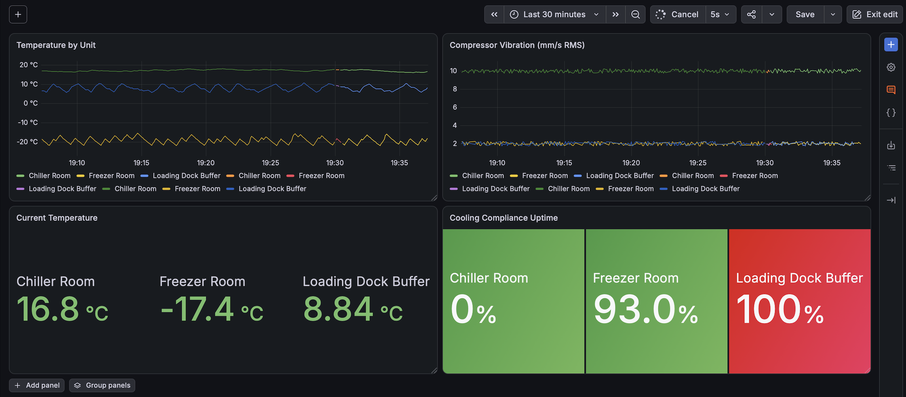

# Cold Chain Monitoring & Predictive Maintenance

An end-to-end industrial IoT stack that monitors three simulated cold storage
units, measures cooling compliance uptime, and distinguishes routine door
events from genuine compressor failure.

Built with Docker, MQTT, Node-RED, InfluxDB and Grafana.

<!-- Add your dashboard screenshot here:
     docs/dashboard.png
-->


---

## The problem

Cold storage failures are expensive and quiet. A chiller that drifts from 2 °C
to 8 °C over six hours can spoil an entire pallet of stock without ever
triggering a simple high-temperature alarm — and by the time it does trigger,
the damage is done.

The naive fix is a threshold alarm: *if temperature > 5 °C, alert*. In practice
that fires constantly, because staff open doors all day. Operators learn to
ignore it, and the one alert that mattered gets ignored along with the rest.
This is alarm fatigue, and it is the reason a lot of real monitoring systems
are quietly useless.

**The actual engineering problem is not detecting that temperature rose. It is
deciding whether this particular rise matters.**

---

## Distinguishing the two failure modes

Both faults present as "temperature is climbing." They require opposite
responses.

| | Door event | Failing compressor |
|---|---|---|
| Temperature | Sharp spike | Slow drift |
| Duration | 10–25 seconds | Hours |
| Vibration | Unchanged | Rising steadily |
| Recovers on its own | Yes | No |
| Correct response | Ignore | Schedule maintenance |

The system separates them using three rules:

1. **Corroboration** — compressor health is judged on vibration, an
   independent signal from temperature. A door event moves one; a failing
   compressor moves both.
2. **Persistence** — a temperature breach must last six consecutive readings
   (30 s) before it counts.
3. **Suppression** — breaches are not counted while the door is open. That is
   an operator doing their job, not a fault.

---

## Architecture

```
┌──────────────┐    MQTT     ┌─────────────┐    MQTT    ┌──────────────┐
│  Simulator   │ ──────────► │  Mosquitto  │ ─────────► │   Node-RED   │
│  (Python)    │  telemetry  │   (broker)  │            │  (processing)│
└──────────────┘             └─────────────┘            └──────┬───────┘
                                    ▲                          │
                                    │      alerts              │
                                    └──────────────────────────┤
                                                               │
                                                     write     ▼
                                              ┌────────────────────────┐
                                              │       InfluxDB         │
                                              │   (time series DB)     │
                                              └───────────┬────────────┘
                                                          │ query
                                                          ▼
                                              ┌────────────────────────┐
                                              │        Grafana         │
                                              │      (dashboards)      │
                                              └────────────────────────┘
```

| Component | Role |
|---|---|
| **Python simulator** | Models three cold rooms with realistic thermal physics and injected faults |
| **Mosquitto** | MQTT broker — decouples producers from consumers |
| **Node-RED** | Computes compliance, smooths vibration, applies alert logic |
| **InfluxDB 2.7** | Time-series storage |
| **Grafana** | Operational dashboard and KPIs |

---

## The simulated plant

| Unit | Target | Safe band | Notes |
|---|---|---|---|
| Freezer Room | −20 °C | −24 to −17 °C | Rarely opened |
| Chiller Room | +2 °C | −1 to +5 °C | **Compressor degrades over time** |
| Loading Dock Buffer | +8 °C | +4 to +11 °C | Opened constantly |

Each unit publishes temperature, humidity, door state, compressor state and
vibration every 5 seconds to `coldchain/<unit_id>/telemetry`.

### Thermal model

Temperature follows Newton's law of cooling — heat leaks in at a rate
proportional to the difference between the room and the surrounding warehouse:

```
ΔT = k · (T_ambient − T_room) − (cooling_power × efficiency)
```

This makes the model self-limiting: a failed unit drifts toward ambient and
settles there, rather than running away to physically impossible values. An
earlier version used a fixed heat-gain rate and produced a 47 °C freezer, which
is how the bug was found.

### Fault injection

- **Door events** — random openings lasting 2–5 readings, causing sharp
  recoverable spikes. Frequency varies by unit.
- **Compressor wear** — the chiller's cooling efficiency decays while its
  vibration signature grows. Both symptoms come from a single internal `wear`
  value.

The `wear` value is deliberately **not published**. The monitoring system has
to infer machine health from vibration and drift alone, exactly as it would
with real equipment, where no sensor reports "I am 60 % worn out."

---

## KPIs

**Cooling compliance uptime** — the OEE-availability equivalent for
refrigeration. Each reading is scored 1 or 0 against that unit's own safe band,
so the mean is the fraction of time in compliance.

**Compressor health** — vibration in mm/s RMS, averaged over a rolling
20-reading window and classified against ISO 10816 bands for small machines:

| Band | Status |
|---|---|
| < 2.8 | Healthy |
| 2.8 – 4.5 | Acceptable |
| 4.5 – 7.1 | Warning |
| > 7.1 | Critical |

Single vibration readings are too noisy to act on. Readings taken while the
compressor is stopped are excluded entirely — a machine that is not running
tells you nothing about its condition.

---

## Running it

### Requirements

- Docker Desktop or OrbStack
- Python 3.10+

### Start the stack

```bash
git clone https://github.com/nikspolaroid/coldchain-monitor.git
cd coldchain-monitor
docker compose up -d
```

| Service | URL |
|---|---|
| Node-RED | http://localhost:1880 |
| InfluxDB | http://localhost:8086 |
| Grafana | http://localhost:3000 |

### First-time configuration

1. **InfluxDB** (http://localhost:8086) — complete the setup wizard with
   organisation `coldchain` and bucket `telemetry`. Copy the API token it
   shows you; it is only displayed once.

2. **Environment** — copy the template and paste your token in:

   ```bash
   cp .env.example .env
   ```

3. **Node-RED** (http://localhost:1880) — install
   `node-red-contrib-influxdb` via **Menu → Manage palette**, then set your
   token on the InfluxDB node.

4. **Grafana** (http://localhost:3000) — log in with `admin` / `admin`, add an
   InfluxDB data source using Flux, URL `http://host.docker.internal:8086`,
   then import `grafana/dashboard.json`.

   > The dashboard JSON references a data source by internal UID. After
   > importing, re-point each panel at your own InfluxDB data source.

### Run the simulator

```bash
python3 -m venv venv
source venv/bin/activate
pip install -r requirements.txt
python simulator/coldchain_sim.py
```

Watch the chiller: within roughly 20 minutes its vibration climbs past the
warning band and its temperature drifts out of compliance, while the other two
units stay healthy.

---

## Repository layout

```
├── docker-compose.yml       # whole stack, one command
├── simulator/
│   └── coldchain_sim.py     # three-unit plant simulation
├── mosquitto/config/        # MQTT broker configuration
├── node-red/data/flows.json # processing and alerting flows
├── grafana/dashboard.json   # exported dashboard
└── .env.example             # template for secrets
```

---

## Engineering notes

**Container networking.** Services reach the host via
`host.docker.internal`, not `localhost`. Inside a container, `localhost` means
that container. This is the most common failure when wiring the stack together.

**Tag cardinality.** Compressor health is stored as a *field*, not a *tag*. An
early version tagged it, and because the value changes over time, every
transition created a new InfluxDB series — fragmenting every chart into nine
lines instead of three. Tags are for stable identity; anything that varies over
time belongs in fields. At production scale this mistake is a well-known way to
exhaust a time-series database.

**Alert latching.** Each alert fires once per event and re-arms only after the
unit recovers. Without this, a sustained fault emits an identical alert every
five seconds.

**Silence as output.** Most readings produce no alert at all. A monitoring
system that stays quiet when things are fine is doing its job.

---

## Possible extensions

- Linear regression on the vibration trend to estimate remaining useful life
- Grafana alert rules with email or webhook delivery
- MQTT authentication (currently anonymous, which is acceptable only locally)
- Replay of recorded telemetry for testing detection logic against known faults
- Energy consumption modelling and cost-per-degree metrics

---

## Licence

MIT
